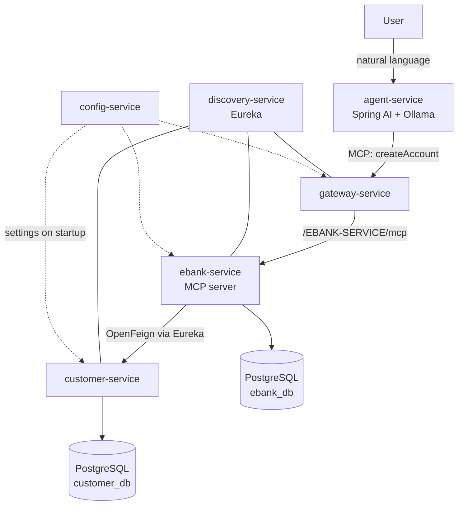

# Banking Microservices Platform with an AI Agent (Spring Cloud + Spring AI + MCP)

A microservices banking platform built with Spring Boot and Spring Cloud,
extended with an AI agent that performs **real, validated business actions**
across services through the Model Context Protocol (MCP) and a locally hosted
model (Ollama).

The agent turns a sentence such as *"open a current account of 5000 for
customer 1"* into an actual bank account — created by the banking service,
after it has checked that the customer exists and that the account type is one
this bank opens.

**The interesting part is not that the model can call a tool. It is what
happens when it calls it badly.**

---

## What the agent may and may not do

A language model produces arguments that are *plausible*, not *correct*. An
agent wired straight to a database will happily persist `"compte courant"`,
`"CHECKING"`, or an account for a customer who does not exist — and then report
success in fluent prose.

Everything the agent can do therefore goes through one narrow door,
`BankMcpTools`, and every argument is validated on the far side of it:

| The model sends | What happens | Result |
|---|---|---|
| `CURRENT-ACCOUNT`, `current-account`, `Current Account` | parsed to the same enum | account created |
| `CHECKING`, `compte courant`, empty | rejected, valid values returned to the model | `400`, nothing stored |
| a customer id that does not exist | rejected after an OpenFeign check against customer-service | `422`, nothing stored |
| a negative opening balance | rejected before any remote call | `400`, nothing stored |

The rejection message lists the accepted values on purpose: it goes back to the
model as the tool result, so it can correct itself instead of failing silently.

Being lenient on spelling while strict on storage is the deliberate trade-off —
rigid parsing makes the tool unusable, permissive parsing puts junk in a
banking database.

---

## Tool-call reliability, measured

Claims about an agent are cheap, so this one is measured.
[`scripts/measure_tool_calls.py`](scripts/measure_tool_calls.py) repeats each
request ten times and judges the outcome **by reading the accounts afterwards**
— never by reading the model's reply, which announces success either way.

Model `llama3.1`, ten runs per scenario:

| Scenario | Request | Expected | Result |
|---|---|---|---:|
| `valid_request` | *"open a current account of 5000 for customer 1"* | one correct account | **10/10** |
| `unknown_customer` | *"open a current account of 5000 for customer 99"* | nothing created | **10/10** |
| `invalid_type` | *"open a crypto wallet account of 5000 for customer 1"* | nothing created | **0/10 → 10/10** |

Full output in [`results/`](results/), including the run that failed.

### What the measurement found

The first two rows are the guardrails doing their job. In `unknown_customer`
the model does send `customerId = 99`; `ebank-service` checks it against
`customer-service` and refuses. Argument validation works.

**The third row is the interesting one, and it started at zero.** Asked for a
product this bank does not sell, the model opened a **savings account** instead
and reported *"Account created successfully"* — ten times out of ten.

No amount of argument validation could have caught it. The model never sent an
invalid type: it picked a valid one. **Validating a tool's arguments does not
protect against the model substituting the intent behind them** — the guardrail
only sees values that are actually sent.

The only layer able to refuse is the one deciding to make the call, so the fix
went into the agent's system prompt: name the two products, and forbid
substituting anything else. Re-measured afterwards: **10/10, with no regression
on the other two scenarios.**

### Two layers, and what each one covers

| Failure | Caught by | Where |
|---|---|---|
| invalid argument value | type and owner validation | `ebank-service` — the service refuses |
| owner that does not exist | OpenFeign check | `ebank-service` — the service refuses |
| **intent silently substituted** | **instruction** | `agent-service` — the model declines to call |

Service-side validation is the layer that cannot be talked out of it, so it
stays the primary defence. But it has a blind spot, and this repository names
it rather than hoping nobody looks.

### A second model

The same 30 runs against `qwen2.5`, on the same hardware: **10/10 on all three
scenarios**, at **23 seconds per request against 34** for `llama3.1`. Identical
outcomes, a third less time.

The model is a startup setting, so switching costs one environment variable:

```bash
LLM_MODEL=qwen2.5 docker compose up -d --force-recreate agent-service
```

### What these numbers do not say

- `qwen2.5` was measured **only after** the prompt fix. Nothing here says
  whether it would have substituted the product like `llama3.1` did.
- Ten runs per scenario separates 0/10 from 10/10. It would not separate 8/10
  from 9/10, and the numbers should not be read to that precision.
- Three scripted scenarios are a probe, not a red-team exercise. A deliberately
  adversarial prompt would very likely still find a way through.

---

## Overview

| Service | Port | Responsibility |
|---|---|---|
| `discovery-service` | 8761 | Service registry (Netflix Eureka). |
| `config-service` | 8888 | Centralised configuration (Spring Cloud Config). |
| `customer-service` | 8056 | Customers; own PostgreSQL database, Flyway-managed schema. |
| `ebank-service` | 8057 | Bank accounts; own PostgreSQL database; validates the customer; **hosts the MCP server**. |
| `gateway-service` | 8058 | API gateway, routes built from the Eureka registry. |
| `agent-service` | 8060 | AI agent (Spring AI + Ollama), **MCP client**. |

## Architecture



The agent never touches a database. It decides *which* tool to call and with
*which* arguments; the call travels over MCP to `ebank-service`, which owns the
operation, validates it, and may refuse it.

---

## Getting started

**Prerequisites**

- Docker Desktop
- [Ollama](https://ollama.com) running on the host, with the model pulled:
  ```bash
  ollama pull llama3.1
  ```
- JDK 25 only if you want to build outside Docker

**Start everything**

```bash
docker compose up -d --build
```

That is the whole setup. Services carry working defaults, so nothing else has
to be installed or configured — see [Configuration](#configuration) for why
that matters.

Startup order is driven by health checks, so the platform is ready when the
command returns. Check the registry at <http://localhost:8761>.

**Try it**

```bash
curl "http://localhost:8060/agent?message=open%20a%20current%20account%20of%205000%20for%20customer%201"
```

```bash
curl http://localhost:8057/accounts
```

The first local run is slow: the model has to be loaded into memory.

---

## Services and endpoints

The two services that expose a business API carry interactive documentation
(springdoc): <http://localhost:8056/swagger-ui.html> and
<http://localhost:8057/swagger-ui.html>.

### customer-service — port 8056

| Method | Path | |
|---|---|---|
| `GET` | `/customers` | list customers |
| `GET` | `/customers/{id}` | one customer, `404` if unknown |
| `POST` | `/customers` | create a customer, `201` |

Three customers are seeded on startup.

### ebank-service — port 8057

| Method | Path | |
|---|---|---|
| `GET` | `/accounts` | list accounts |
| `GET` | `/accounts/{id}` | one account, `404` if unknown |
| `POST` | `/accounts` | create an account, `201` |
| `POST` | `/mcp` | MCP server endpoint (streamable HTTP) |

```bash
curl -X POST http://localhost:8057/accounts \
  -H "Content-Type: application/json" \
  -d '{"type":"SAVING-ACCOUNT","balance":1500,"customerId":2}'
```

Errors are returned as RFC 7807 `ProblemDetail`, the same shape Spring uses for
its own errors:

```json
{
  "type": "about:blank",
  "title": "Unknown customer",
  "status": 422,
  "detail": "No customer with id 99; the account was not created"
}
```

### agent-service — port 8060

Three endpoints, deliberately kept apart, because they carry very different
risk:

| Method | Path | What the model is allowed to do |
|---|---|---|
| `GET` | `/chat?message=...` | produce text, nothing else |
| `GET` | `/extract?message=...` | produce typed fields, still without acting |
| `GET` | `/agent?message=...` | call a tool, and so change state |

### gateway-service — port 8058

Routes are derived from the Eureka registry, so a new service becomes reachable
without touching the gateway:

```
http://localhost:8058/{SERVICE-NAME}/**
```

For example <http://localhost:8058/EBANK-SERVICE/accounts>.

---

## Model Context Protocol

- `ebank-service` is an **MCP server** (`spring-ai-starter-mcp-server-webmvc`).
  Its account-creation capability is published with `@McpTool`.
- `agent-service` is an **MCP client** (`spring-ai-starter-mcp-client`). It
  discovers the available tools at startup and offers them to the model.
- Transport is **streamable HTTP**, not stdio: the two run in separate
  processes, and in Docker in separate containers.

The agent reaches the MCP server *through the gateway*, so it holds no address
for `ebank-service` at all.

Flow of one account creation:

1. The user sends a sentence to `agent-service`.
2. The model decides to call `createAccount` and fills its arguments.
3. The call travels over MCP to `ebank-service`.
4. `ebank-service` validates the type, then the customer, then persists.
5. The result — success or a typed error — goes back to the model, which
   answers the user.

---

## Configuration

Two mechanisms, and the order between them is the point:

1. **Every service ships working defaults** in its own
   `application.properties`.
2. **`config-service` overrides them** when it is reachable. The import is
   declared `optional:`, so its absence is not a startup failure.

```properties
spring.config.import=optional:configserver:${CONFIG_SERVER:http://localhost:8888}
```

This is what makes a fresh clone runnable. A configuration server holding
values that exist nowhere else turns "clone and run" into "clone, find the
second repository, and hope it is reachable".

`config-service` serves files bundled in its own jar (`native` profile) rather
than cloning a Git repository, for the same reason.

The two sources are kept in agreement by
`ConfigServiceApplicationTests`, which asserts that the served values match the
built-in defaults. If they ever drift, the build fails rather than the
deployment.

---

## Running the tests

```bash
./mvnw verify
```

Builds and tests all six services. Unit tests use JUnit 5, Mockito and AssertJ;
no test needs Docker, a registry or a model.

What is actually covered:

- `AccountTypeTest` — the spellings a model produces are accepted, everything
  else is refused, and the rejection message names the valid values.
- `EbankServiceTest` — an unknown customer and a negative balance both leave
  the database untouched; an account is still readable when
  `customer-service` is down.
- `ConfigServiceApplicationTests` — served configuration matches the defaults.

CI runs the same command on every push.

---

## Technology stack

Java 25 · Spring Boot 4.1.0 · Spring Cloud 2025.1.2 (Eureka, Gateway,
OpenFeign, LoadBalancer, Config) · Spring AI 2.0.0 (Ollama, MCP server and
client) · PostgreSQL · Flyway · Spring Data JPA · Lombok · springdoc-openapi ·
JUnit 5 · Mockito · AssertJ · Testcontainers · Docker Compose · Maven wrapper.

## Project structure

```
.
├── config-service        Configuration server (native profile, config bundled)
├── discovery-service     Eureka registry
├── gateway-service       API gateway
├── customer-service      Customers
├── ebank-service         Accounts, MCP server, domain validation
├── agent-service         AI agent, MCP client
├── scripts/              Tool-call reliability measurement
├── results/              Measurement output
├── docker-compose.yml    The whole platform
└── pom.xml               Aggregator: builds and tests every service
```

## Persistence

Each service that stores data owns a private PostgreSQL database
(`database-per-service`): nothing is shared, so a schema change in one service
cannot break another. The schema is owned by **Flyway** versioned migrations,
and Hibernate is set to `validate` only - it never alters the database, it just
refuses to start if an entity and its migration have drifted apart. Integration
tests run against a real PostgreSQL started in a throw-away **Testcontainers**
container, so the migrations and the PostgreSQL dialect are exercised, not an
H2 approximation. Connection details are injected through `DB_*` environment
variables, never committed.

## Limitations

- No authentication. The gateway is the natural place to add it and it is not
  done here.
- The MCP server exposes a single tool. Deposits, withdrawals and transfers
  would each need the same validation treatment before being exposed to a
  model.

## License

MIT — see [LICENSE](LICENSE).
