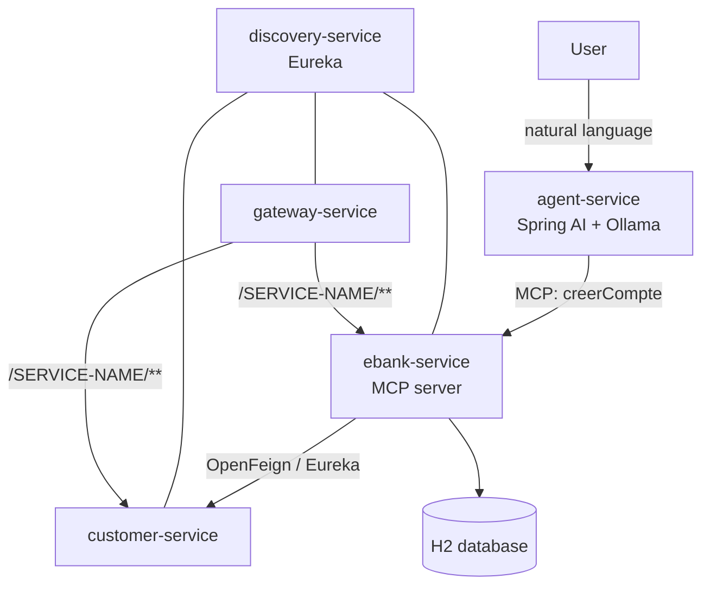

# Banking Microservices Platform with AI Agent (Spring Cloud + Spring AI + MCP)

A microservices banking platform built with Spring Boot and Spring Cloud, extended with an
AI agent that performs real business actions across services using the
Model Context Protocol (MCP) and a locally hosted large language model (Ollama).

The agent turns a natural-language request such as
*"create a current account of 5000 for customer 1"* into a real, validated bank account,
created by the banking service and persisted in its database.

## Overview

The system is composed of five services:

| Service            | Port | Responsibility                                                        |
|--------------------|------|-----------------------------------------------------------------------|
| discovery-service  | 8761 | Service registry (Netflix Eureka).                                    |
| gateway-service    | 8058 | API gateway with dynamic routing through Eureka.                      |
| customer-service   | 8056 | Manages customers (H2 in-memory database).                           |
| ebank-service      | 8057 | Manages bank accounts; validates the customer through customer-service; exposes an MCP server. |
| agent-service      | 8060 | AI agent (Spring AI + Ollama); MCP client that consumes ebank tools. |

`ebank-service` validates every account creation by calling `customer-service`
through OpenFeign and Spring Cloud LoadBalancer. If the customer does not exist,
the account is rejected.

## Architecture



The AI agent never accesses the database directly. It decides which tool to call and with
which arguments; the tool call is transported over MCP to `ebank-service`, which owns and
performs the account creation.

## Technology Stack

- Java 25
- Spring Boot 4.1.0
- Spring Cloud 2025.1.2 (Netflix Eureka, Gateway, OpenFeign, LoadBalancer)
- Spring AI 2.0.0 (Ollama integration, MCP server and client)
- Model Context Protocol (MCP), streamable HTTP transport
- Ollama (local LLM, model `llama3.1`)
- H2 in-memory database, Spring Data JPA
- Lombok
- JUnit 5, Mockito, AssertJ
- Docker and Docker Compose
- Maven (wrapper included)

## Prerequisites

- JDK 25
- Docker Desktop
- Ollama installed and running, with the model pulled:
  ```
  ollama pull llama3.1
  ```

## Getting Started

### 1. Start the core services (Docker Compose)

From the project root:

```
docker-compose up -d --build
```

This builds and starts `discovery-service`, `customer-service`, `ebank-service` and
`gateway-service`. Allow about 30 seconds for the services to register in Eureka.

Verify the registry at `http://localhost:8761` and the banking service at
`http://localhost:8057/accounts`.

### 2. Start the AI agent (local)

`agent-service` runs locally because it connects to Ollama on the host machine. Make sure
Ollama is running, then:

```
./agent-service/mvnw.cmd -f agent-service/pom.xml spring-boot:run
```

At startup, the MCP client connects to the `ebank-service` MCP server and discovers its tools.

## Services and Endpoints

### customer-service (port 8056)

- `GET /customers` - list all customers
- `GET /customers/{id}` - get a customer by id
- `POST /customers` - create a customer

Three customers are seeded on startup.

### ebank-service (port 8057)

- `GET /accounts` - list all bank accounts
- `GET /accounts/{id}` - get an account by id
- `POST /accounts` - create an account (body: `type`, `balance`, `customerid`)
- `POST /mcp` - MCP server endpoint (streamable HTTP)

The MCP server publishes a `creerCompte` tool that creates a validated bank account.

### agent-service (port 8060)

- `GET /chat?message=...` - plain conversation with the model
- `GET /extraire?message=...` - structured extraction (returns a JSON object)
- `GET /agent?message=...` - AI agent that can create accounts through MCP

Example:

```
http://localhost:8060/agent?message=create a current account of 5000 for customer 1
```

### Gateway (port 8058)

Routing is dynamic, based on the service names registered in Eureka:

```
http://localhost:8058/{SERVICE-NAME}/**
```

Example: `http://localhost:8058/EBANK-SERVICE/accounts`

## Model Context Protocol (MCP)

- `ebank-service` is an MCP server (`spring-ai-starter-mcp-server-webmvc`). Its account
  creation capability is exposed with the `@McpTool` annotation.
- `agent-service` is an MCP client (`spring-ai-starter-mcp-client`). It connects to the
  banking service, discovers its tools automatically, and makes them available to the model.

Request flow for account creation:

1. The user sends a natural-language request to `agent-service`.
2. The model decides to call the `creerCompte` tool and fills its arguments.
3. The call is transported over MCP to `ebank-service`.
4. `ebank-service` validates the customer and persists the account.
5. The result is returned to the model, which replies to the user.

## Running the Tests

`ebank-service` includes unit tests written with JUnit 5, Mockito and AssertJ:

```
./ebank-service/mvnw.cmd -f ebank-service/pom.xml test
```

## Project Structure

```
.
├── discovery-service     Eureka service registry
├── customer-service      Customer management
├── ebank-service         Account management and MCP server
├── getway-servicce       API gateway
├── agent-service         AI agent and MCP client
└── docker-compose.yml    Orchestration of the core services
```

## Notes

- The databases are H2 in-memory instances; data is reset on each restart.
- `agent-service` currently runs outside Docker Compose so it can reach the local Ollama
  instance.
